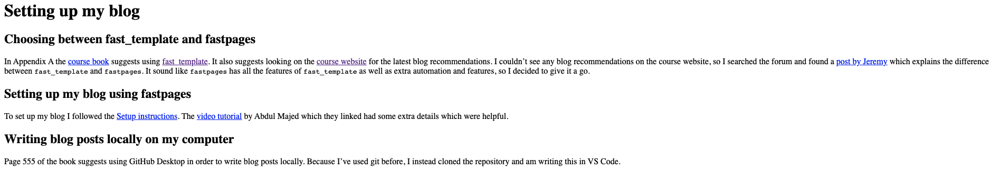

# Setting up my blog

## Choosing between fast_template and fastpages
In Appendix A the [course
book](https://www.amazon.co.uk/Deep-Learning-Coders-fastai-PyTorch/dp/1492045527)
suggests using [fast_template](https://github.com/fastai/fast_template). It also
suggests looking on the [course website](https://course.fast.ai/) for the latest blog
recommendations. I couldn't see any blog recommendations on the course website, so I
searched the forum and found a [post by
Jeremy](https://forums.fast.ai/t/about-the-nbdev-fastpages-category/61743) which
mentions [fastpages](https://github.com/fastai/fastpages) and explains the difference
between `fast_template` and `fastpages`. It sound like `fastpages` has all the features
of `fast_template` as well as extra automation and features, so I decided to give it a
go.

## Setting up my blog using fastpages
To set up my blog I followed the [Setup
instructions](https://github.com/fastai/fastpages#setup-instructions). The [video
tutorial](https://www.youtube.com/watch?v=L0boq3zqazI&ab_channel=1littlecoder) by Abdul
Majed which they linked had some extra details which were helpful.

## Writing blog posts locally on my computer
Page 555 of the book suggests using GitHub Desktop in order to write blog posts locally.
Because I've used git before, I instead cloned the repository and am writing this in VS
Code.

## Making the blog post format correctly
Initially my blog post looked like this:

<!--  -->
<!--  -->

To get the page to format correctly I had to add Front Matter, following these
[instructions](https://github.com/fastai/fastpages#customizing-blog-posts-with-front-matter).
